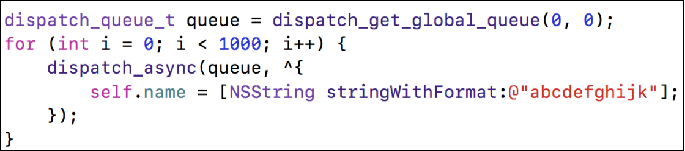
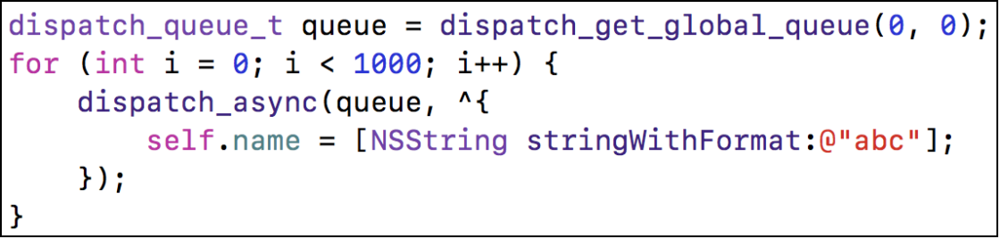

# 内存管理相关面试题

#### 1、CADisplayLink和NSTimer使用的注意点？
CADisplayLink、NSTimer会对target差生强饮用，如果target又对他们产生强引用，那么就会引发循环引用

解决方案：
* 使用block，注意 block 循环引用问题
 
```
__weak typeof(self) weakSelf = self;
self.timer = [NSTimer scheduledTimerWithTimeInterval:1.0f repeats:YES block:^(NSTimer * _Nonnull timer) {
        [weakSelf timerTest];
    }];
```

* 使用代理对象（NSProxy）

```
// MCProxy1 继承自 NSObject
@interface MCProxy1 : NSObject
/**
 * 注意这里要用weak修饰对象
 */
@property (weak, nonatomic)   id  target;
+ (instancetype)proxyWithTarget:(id)target;
    
@end

@implementation MCProxy1
+ (instancetype)proxyWithTarget:(id)target
{
    MCProxy1 *proxy = [[MCProxy1 alloc] init];
    proxy.target = target;
    return proxy;
}

/**
 * 这里实现消息转发，完成target方法的调用
 */
- (id)forwardingTargetForSelector:(SEL)aSelector
{
    return self.target;
}

@end
```

```
// MCProxy 继承自 NSProxy

@implementation MCProxy

+ (instancetype)proxyWithTarget:(id)target
{
    // NSProxy对象不需要调用init，因为它本来就没有init方法
    MCProxy *proxy = [MCProxy alloc];
    proxy.target = target;
    return proxy;
}

/**
 * 注意：
 * NSProxy对象特殊，消息转发阶段，不调用 forwardingTargetForSelector 方法
 * 只调用 methodSignatureForSelector 和 forwardInvocation 两个方法
 */

- (NSMethodSignature *)methodSignatureForSelector:(SEL)sel
{
    return [self.target methodSignatureForSelector:sel];
}

- (void)forwardInvocation:(NSInvocation *)invocation
{
    [invocation invokeWithTarget:self.target];
}

@end
```

#### 2、GCD实现定时器？

注意：要对 timer 进行强引用，否则无法触发定时器
```
// 创建队列
dispatch_queue_t queue = dispatch_get_main_queue();
    
// 创建定时器
dispatch_source_t timer = dispatch_source_create(DISPATCH_SOURCE_TYPE_TIMER, 0, 0, queue);
    
// 设置时间
uint64_t start = 2.0;     // 2秒后执行
uint64_t interval = 1.0;  // 每隔1秒执行
dispatch_source_set_timer(timer, DISPATCH_TIME_NOW, start * NSEC_PER_SEC, interval * NSEC_PER_SEC);
   
// 设置回调
dispatch_source_set_event_handler(timer, ^{
    NSLog(@"-----11111-----");
});
dispatch_resume(timer);
```

#### 3、思考以下2段代码能发生什么事？有什么区别？

上述代码会产生崩溃，崩溃原因：就是我们在调用 self.name = xxx的时候，实际上调用的是 - (void)setName:(NSString *)name; 并且 setName 内部调用实现如下

```
- (void)setName:(NSString *)name
{
    if(_name != name){
        [_name release];
        _name = [name copy];
    }
}
```
由于我们是异步调用此方法，可能导致多个线程同时访问此方法，一旦调用了 [_name release]；方法，再去调用机会出现崩溃现象


此方法不会崩溃，因为 self.name 此时被包装成 Tagged Pointer对象，无论创建多少次，都是一个内存地址，故不会出现崩溃问题